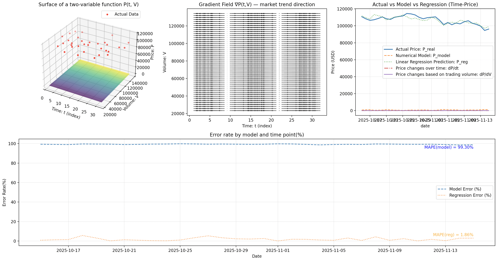
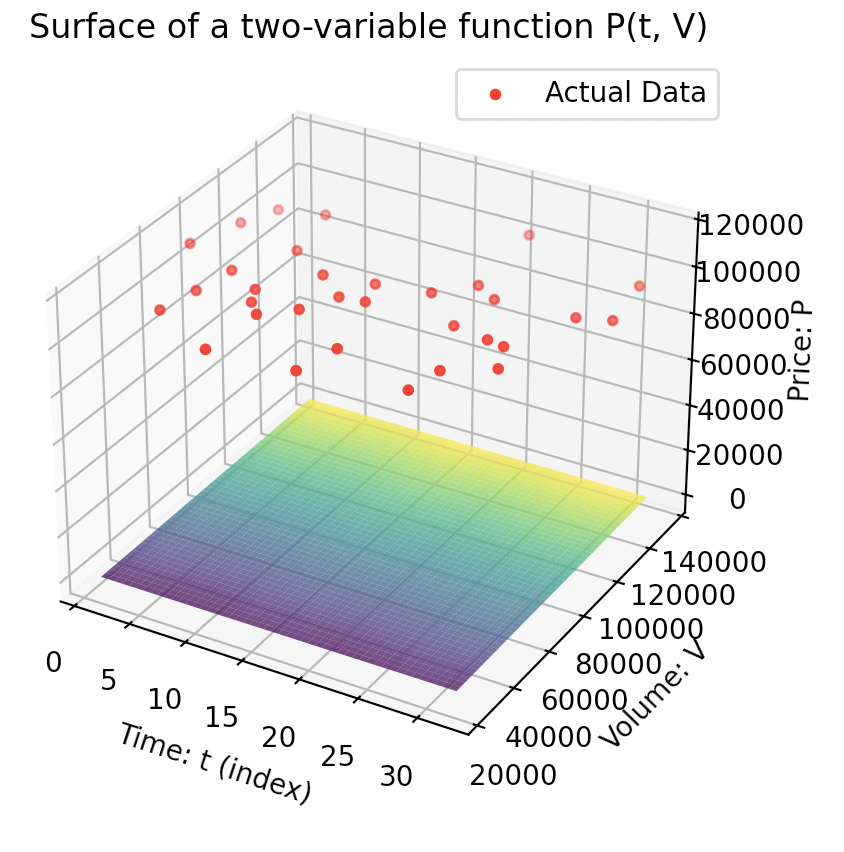
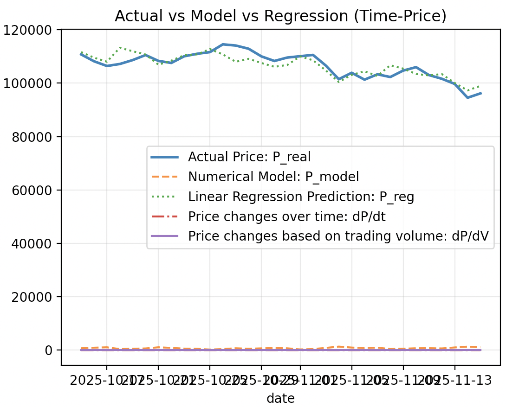
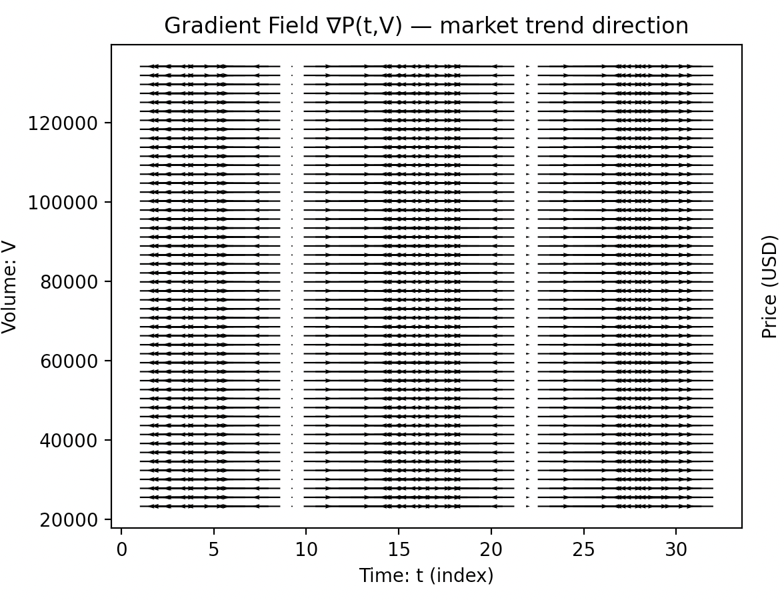
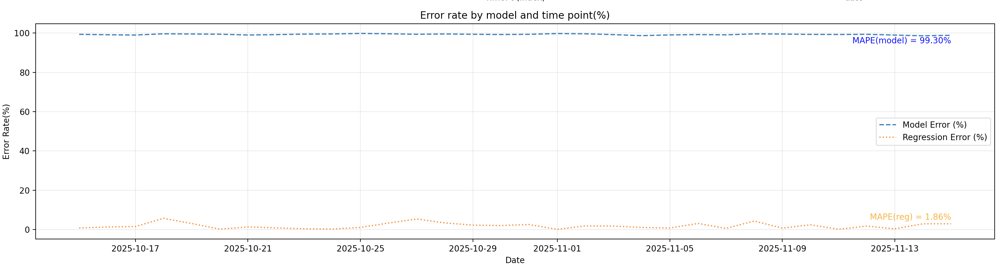
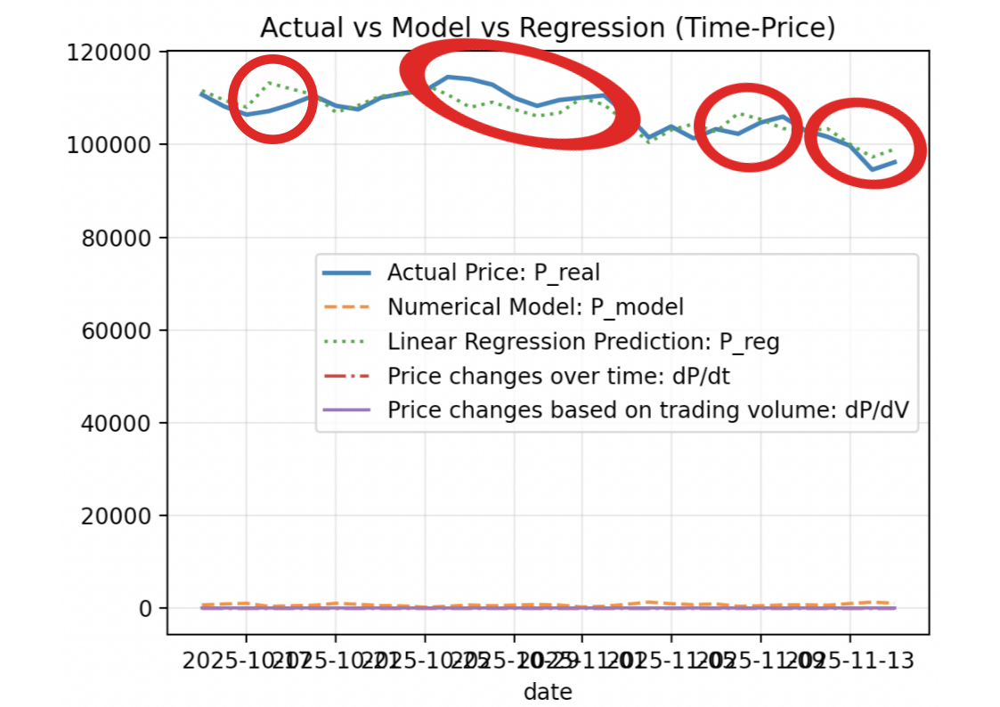

# 미적분학과 벡터 해석 경제 분야에서의 응용
## 2변수 함수 기반 수치 모델을 적용한 암호화폐 가격 예측 실험
이 실험은 미적분학의 개념인 2변수 함수와 편미분을 이용하여 미래 시장 가격을 예측할 수 있는지를 탐구한다.

**경고**:
>본 보고서는 교육 및 학술적 목적을 위해서 작성되었습니다.
>제시되는 수치, 분석, 추정치는 교육적 목적으로만 제공되며, 이외 실제 금융 투자에 사용될 수 없습니다.
>본 문서는 특정 자산의 매수, 매도, 보유를 권유하지 않으며 투자 결정에 대한 어떠한 책임도 지지 않습니다.
>암호화폐는 가격 변동성이 매우 큰 고위험 자산으로 문서의 분석 결과를 실제 투자 판단에 사용하는 것은 적절치 않음을 알립니다.
>투자의 결과는 온전히 개인의 몫입니다.

## 수치 모델 구성
본 프로젝트에서는 아래와 같은 2변수 함수를 시간과 거래량에 기반한 가격 예측 모델로 설정하였다.
```math
P(t,V)=0.5t+0.01V+10\sin(0.5t)
```
여기서 $t$와 $V$는 각각 시간(Time), 거래량(Volume)을 의미하며 $P$는 가격을 의미한다.
이 모델은 추세($0.5t$), 거래량 민감도($0.01V$), 시장의 주기적 변동($10\sin(0.5t)$)의 합으로 구성되었다.

$t$ 값이 증가할 수록 $P$ 값도 증가할 것이고, $V$ 값이 증가할 수록 $P$ 값도 미세하게 증가할 것이다.
즉, 이 모델은 **장기적으로 우상향 하는 시장 상황**을 의미한다.
### 시간에 대한 편미분의 해석
```math
\frac{\partial P}{\partial t}=0.5+5\cos(0.5t)
```
이 값은 시간이 조금 변할 때 가격이 얼마나 변하는지, 즉 **가격의 순간적 시간 추세**(**momentary trend**)를 나타낸다.
- $0.5$: 장기적인 우상향 추세
- $5\cos(0.5t)$: 단기적으로 상승, 하락을 반복하게 만드는 주기적 요인

따라서 $\frac{\partial P}{\partial t}>0$이면 시장의 **상승 추세**, $\frac{\partial P}{\partial t}<0$이면 시장의 **하락 추세**임을 의미한다.
이 값의 부호가 정기적으로 바뀌므로, 모델은 가격이 **상승–하락을 반복하는** 단순한 사이클 구조를 가지며 이는 곡면 그래프와 벡터장에서 확인할 수 있다.
### 거래량에 대한 편미분의 해석
```math
\frac{\partial P}{\partial V}=0.01
```
이 값은 거래량이 소폭 증가할 때 가격이 얼마나 민감하게 움직이는지를 나타낸다.
- 항상 양수
- 항상 일정

하므로, 이 모델에서 거래량은 가격에 항상 같은 방향(우상향)으로, 같은 크기로 기여하는 단순 인자로 설정되어 있다.
## 실험 결과
[인베스팅닷컴](https://kr.investing.com/crypto/bitcoin/historical-data)에서 대표적인 가상화폐인 Bitcoin의 과거 1개월 CSV 자료를 구할 수 있었다.
실험의 결과는 다음과 같다:


첫 번째 그래프(상단 맨 왼쪽)는 시간과 Bitcoin 거래량에 따른 가격을 시각화한 것이다.
하단 곡면은 가격을 의미한다. 모델이 생성한 곡면은 시간과 거래량에 대해 매우 완만한 기울기만을 가지며 비교적 평탄하게 나타나고 있다.
반면 실제 가격 데이터(빨간 점)는 9만 - 12만 달러 사이에서 크게 요동치며, 모델 곡면보다 훨씬 높은 수준과 넓은 변동 폭을 보인다.

이것은 모델이 예측한 시장 가격이 실제 형성된 시장 가격을 **전혀 반영하지 못함**을 의미한다.


이 실험의 결과는 세 번째 그래프(상단 맨 오른쪽)에서 확실하게 드러난다.
파란색 실선은 실제 시장 가격, 초록색 점선은 선형 회귀를 이용한 가격 예측, 하단 주황색 파선은 앞서 제시한 수치 모델에 의해 예측된 시장 가격을 의미한다.

위 그래프는 실제 가격과 수치 모델이 예측한 가격이 8만 달러 이상 괴리가 발생하는 것을 보여주는데, 이 이유로 인해 시간에 대한 편미분 추측한 단기적인 미래 시장 상황도 **무의미한 수준**임을 알 수 있다.


이 벡터장 그래프는 수치 모델이 예측하는 가격 변화의 순간적 방향을 나타내며, 모델이 단기 시장 변동을 매우 단순화된 구조로 설명하고 있음을 시각적으로 확인할 수 있다.

그림에서 보이는 특징으로는
1. 화살표가 거의 수평
2. 세로 방향 변화가 거의 없음
3. 일부 구간에서는 $-$방향(왼쪽), 다른 일부 구간에서는 $+$방향(오른쪽)

벡터장이 거의 1차원으로만 움직인다.


실제 가격 대비 오차율을 보면, 수치 모델 기반 예측 가격의 평균 오차율(MAPE)와 매 시점별 오차율(파란색 파선)이 거의 100%에 육박하는 것을 관찰할 수 있다.
이것은 선형 회귀 기반 예측 가격의 오차율이 2%대에 머무르는 것과 대비된다.
## 고찰: 실제 데이터와 모델 간 괴리가 발생하는 이유
수치 모델 $P(t,V)$는 굉장히 단순히 설계된 모델이므로 실제 암호화폐 시장의 복잡성을 거의 반영하지 못했다.
다음과 같은 구조적 한계로 인해 실제 가격과 큰 오차가 발생한다.
### 1. 거래량의 영향이 지나치게 단순함
```math
\frac{\partial P}{\partial V}=0.01
```
이 값은 거래량의 영향이 **항상 동일**하고, 그 영향이 **항상 양수**임을 의미한다.
그러나, 실제 시장에서는
- 거래량 증가가 우상향의 신호라는 보장이 없고
- 체결 강도, 매수 및 매도 비율, 변동성 등 다양한 요인과 얽혀 있으며
- 거래량이 가격에 미치는 영향이 비선형적이다

따라서, 단순 선형항인 $0.01V$는 **실제 시장 구조를 반영하지 못한다**.
### 2. 시간 변화의 모델링이 지나치게 단순함
```math
P(t,V)=0.5t+0.01V+10\sin(0.5t)
```
이 모델은 가격이 일정한 우상향 추세에 사인파 형태의 단순한 변동을 더한 형태를 띤다.

하지만 실제 암호화폐 시장은
- 외부 요인(뉴스, 금리, 각종 법률과 정책)
- 갑장스러운 급등과 급락
- 투자자 심리
- 시장 유동성
- 반감기로 인한 공급량 문제

을 포함한 복잡한 시계열이며, 단순한 사인 함수로 이런 변동을 근사할 수 없다.
### 3. “기울기 벡터장”의 해석이 문제를 명확히 보여줌
벡터장을 그려보면, 대부분의 화살표가 $t$축 방향(수평) 으로만 움직는 단순한 구조를 보인다.
이는 모델이 가격 변화를 사실상 **시간 변화 하나로만 설명한다는 의미**이다.

즉, 모델은 *투자자 거래량 패턴*, *비선형 순간 변동* 등 가격 변화의 주요 요인들을 전혀 반영하지 않는다는 것이다.

이로 인해 모델 기반 예측치는 실제 데이터와 큰 오차(MAPE)로 나타나며,
이는 “기술적 분석 기반 단순 모델은 시장 예측에 한계가 있다”는 결론으로 직결된다.
### 왜 선형 회귀 기반 모델은 실제 데이터와 유사한 추세를 그리는가?
회귀 기반 모델은 다음의 형태를 사용한다:
```math
P(t,V)=d+at+bv+c\sin(0.5t)
```
이는 초기 모델과 동일한 구조를 유지하되,
계수 $a$, $b$, $c$, $d$를 실제 데이터로부터 학습한 모형이다.
#### I. 회귀 모델의 장점
1. 계수 $a$, $b$, $c$가 실제 데이터의 변화를 반영함.
2. $b$가 실제 거래량의 영향력을 나타내므로 단순 모델보다 현실적임.

따라서 회귀 기반 모델은 **데이터에 기반한 추세**를 반영하므로 단순 모델보다 현실성이 높다.
이것이 회귀 모델이 추측한 가격이 실제 시장 가격을 부드럽게 따라간 이유이자 수치 기반 단순 모델보다 더 낮은 오차율을 보인 이유이다.
#### II. 그러나 여전히 존재하는 한계

그러나 회귀 모델의 구조 자체가
- 선형 $t$항,
- 선형 $V$항,
- 단순한 사인파 기반 변동

이라는 전제를 공유하기 때문에, 여전히 실제 암호화폐 시장의 비선형성과 급변성 등을 충분히 반영하지 못한다.
## 결론
- 2변수 함수를 이용한 단순 수치 모델은 실제 시장을 정확하게 예측하기에 대단히 **부적합하다**.
- 회귀 모델은 단순 모델보다 개선된 추세를 제공하지만, 암호화폐라는 고변동성/비정상 시계열을 설명하기에는 여전히 구조적인 한계를 가진다.

---

## 프로그램 설명과 실행 방법
이 Python 프로그램은 이렇게 구성됩니다:
```sh
.
├── Bitcoin-data.csv
├── data_reader.py
├── error_rate.py
├── main.py
├── plot_drawer.py
├── README.md
├── requirements.txt
└── result
    ├── 1.png
    ├── 2.png
    ├── 3.png
    ├── 4.png
    ├── 5.png
    └── pyplot.png

```

- `Bitcoin-data.csv`: 과거 1개월 Bitcoin의 종가, 거래량, 날짜 등을 포함한 CSV 데이터입니다. 2025년 10월 15일부터 2025년 11월 15일의 데이터가 저장되어 있습니다.
- `data_reader.py`: `pandas` 라이브러리를 이용해 CSV 데이터를 읽어오는 스크립트입니다.
- `error_rate.py`: 실제 시장 가격과 예측 시장 가격의 오차를 계산하는 스크립트입니다.
- `main.py`: 프로그램의 엔트리 포인트입니다. `matplotlib` 라이브러리를 통해 전달받고 계산된 데이터를 시각화합니다.
- `plot_drawer.py`: 그래프를 그리기 이전 데이터들을 가공하고 계산하는 스크립트입니다. 단순한 가격 예측 수치 모델이 포함되어 있습니다. `numpy` 라이브러리로 복잡한 계산을 처리하고 `scikit-learn` 라이브러리로 선형 회귀 기반 모델을 구현했습니다.
- `README.md`: 현재 읽고 계신 문서입니다.
- `requirements.txt`: 프로그램이 사용하는 라이브러리를 명시한 파일입니다. `pip3` 명령으로 쉽게 모든 라이브러리를 설치할 수 있습니다.
- `result/`: 본 문서에 실린 시각 자료들을 담고 있는 디렉터리입니다.

먼저 이 Repository를 클론합니다:
```sh
git clone https://github.com/Resistance-R/Calculus-Python-Economics-Experiment.git
```

클론된 Repository로 이동합니다:
```sh
cd ~/Calculus-Python-Economics-Experiment
```

`main.py` 스크립트를 실행합니다:
```sh
python3 ./main.py
# 위 명령이 실행되지 않는다면:
# python ./main.py
```

만약 `ModuleNotFoundError: No module named ...` 같은 오류가 나며 프로그램이 실행되지 않는다면 이 프로그램이 사용하는 라이브러리가 설치되지 않았다는 뜻이니 `pip3` 명령을 통해 설치해야 합니다.
아래와 같이 설치합니다(`requirements.txt` 사용):
```sh
pip3 install -r requirements.txt
# 위 명령이 실행되지 않는다면:
# pip install -r requirements.txt
```
### 프로그램 실행 결과
아래 같은 그림이 모니터에 출력됩니다:

터미널에는 이런 문자열이 출력됩니다:
```sh
단순 수치 모델 MAPE: 99.30%
선형 회귀 모델 MAPE: 1.86%

선형회귀 계수:
    Intercept = 118061.0268
    a (t 계수) = -316.652566
    b (V 계수) = -0.0830784655
    c (sin 계수) = -205.767235
```
## 실험 기여자
- Python 실험 기획, 구현: 소프트웨어학부 2025245045 명윤재. 
`미적분학과벡터해석(2)` 팀 과제 실험 및 발표용 자료입니다.

---

## 참고 문헌
Investing.com. (2025, November 15). Bitcoin - 비트코인 과거 데이터 - Investing.Com. 인베스팅닷컴. https://kr.investing.com/crypto/bitcoin/historical-data

Matplotlib. (2025). Matplotlib — Pyplot tutorial. matplotlib. https://matplotlib.org/stable/tutorials/pyplot.html

Pandas. (2025). Pandas - User Guide. pandas. http://pandas.pydata.org/docs/user_guide/index.html#user-guide

---